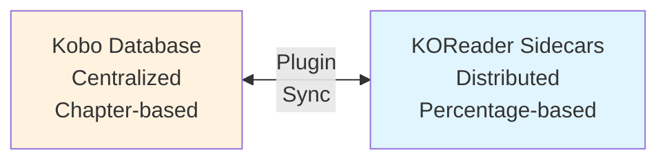

# Architecture Overview

The Kobo Plugin bridges two different reading progress tracking systems: Kobo's centralized SQLite
database and KOReader's distributed sidecar files.

## Core Concept

The plugin acts as a translator and synchronizer between these two fundamentally different systems.

## Key Topics

### [High-Level Architecture](./01-high-level.md)

Visual overview of components and their relationships. Start here to understand the overall system
design.

### [Database & Data Storage](../database/00-overview.md)

How both systems store reading progress, why they're different, and how the plugin bridges the gap.
This is the **most important** section for understanding the plugin's core functionality.
